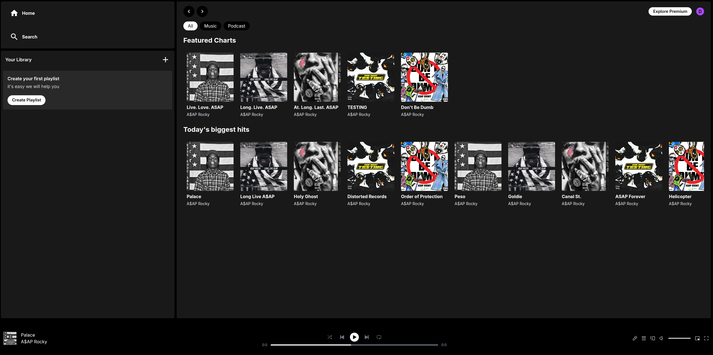
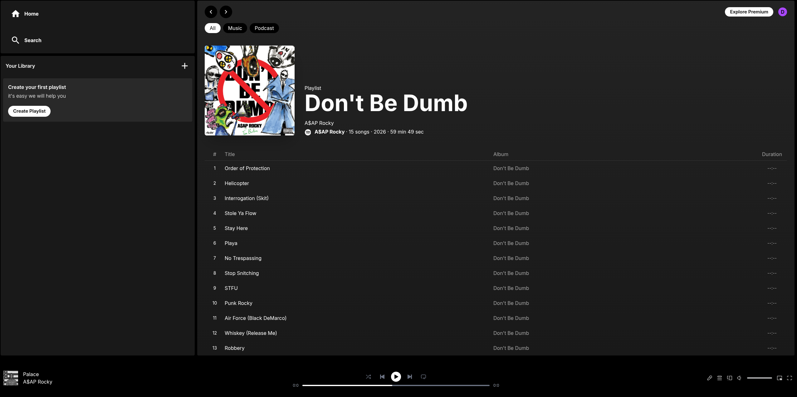

<div align="center">

# 🎵 Spotify React

Un clone full-stack dell'interfaccia Spotify, realizzato con **React 19**, **Vite**, **Tailwind CSS v4** e **PocketBase**.

[](https://react.dev/)
[](https://vitejs.dev/)
[](https://tailwindcss.com/)
[](https://pocketbase.io/)

</div>

---

## Panoramica

Spotify React è una riproduzione fedele dell'interfaccia web di Spotify, collegata a un backend reale. Gli utenti possono sfogliare album, ascoltare brani e gestire la propria libreria — il tutto servito tramite un'istanza PocketBase in self-hosting.

## Screenshot

| Home | Pagina Album |
|:---:|:---:|
|  |  |

## Stack Tecnologico

| Livello | Tecnologia |
|---|---|
| Frontend | React 19, React Router v7 |
| Stile | Tailwind CSS v4 |
| Build Tool | Vite 7 |
| Backend / DB | PocketBase |
| Icone | Lucide React |

## Funzionalità

- **Riproduzione musicale** — streaming dei file audio archiviati su PocketBase
- **Navigazione degli album** — visualizzazione di album con copertine ed elenco tracce
- **Autenticazione utente** — registrazione, login e gestione della sessione
- **Tematizzazione dinamica** — colori d'accento personalizzati per ogni album
- **Routing** — navigazione lato client tramite React Router v7

## Schema del Database

Il backend è basato su PocketBase con le seguenti collezioni:

**`albums`** — `id`, `title`, `owner`, `cover` (file), `color`

**`songs`** — `id`, `title`, `artist`, `album` (→ albums), `duration`, `track`, `file` (audio)

**`users`** — `id`, `name`, `email`, `avatar` (file), campi standard di autenticazione

## Come Iniziare

### Prerequisiti

- [Node.js](https://nodejs.org/) 18+
- Eseguibile di [PocketBase](https://pocketbase.io/docs/)

### 1. Clonare il repository

```bash
git clone https://github.com/Inceptiqn/Spotify-react.git
cd Spotify-react
```

### 2. Configurare PocketBase

Scaricare l'eseguibile di PocketBase per la propria piattaforma da [pocketbase.io](https://pocketbase.io/docs/), posizionarlo nella cartella del progetto e avviarlo:

```bash
./pocketbase serve
```

Aprire `http://127.0.0.1:8090/_/` e importare `pb_schema.json` da **Impostazioni → Importa collezioni**.

### 3. Installare le dipendenze e avviare

```bash
npm install
npm run dev
```

L'applicazione sarà disponibile all'indirizzo `http://localhost:5173`.

## Comandi Disponibili

| Comando | Descrizione |
|---|---|
| `npm run dev` | Avvia il server di sviluppo |
| `npm run build` | Compila per la produzione |
| `npm run preview` | Anteprima della build di produzione |
| `npm run lint` | Analisi statica del codice con ESLint |

## Struttura del Progetto

```
Spotify-react/
├── public/             # Risorse statiche
├── src/                # Codice sorgente dell'applicazione
│   ├── components/     # Componenti UI riutilizzabili
│   ├── pages/          # Pagine associate alle route
│   └── ...
├── pb_schema.json      # Schema delle collezioni PocketBase
├── vite.config.js      # Configurazione di Vite
└── package.json
```

## Licenza

Questo progetto è realizzato a scopo didattico. Spotify™ è un marchio registrato di Spotify AB.
